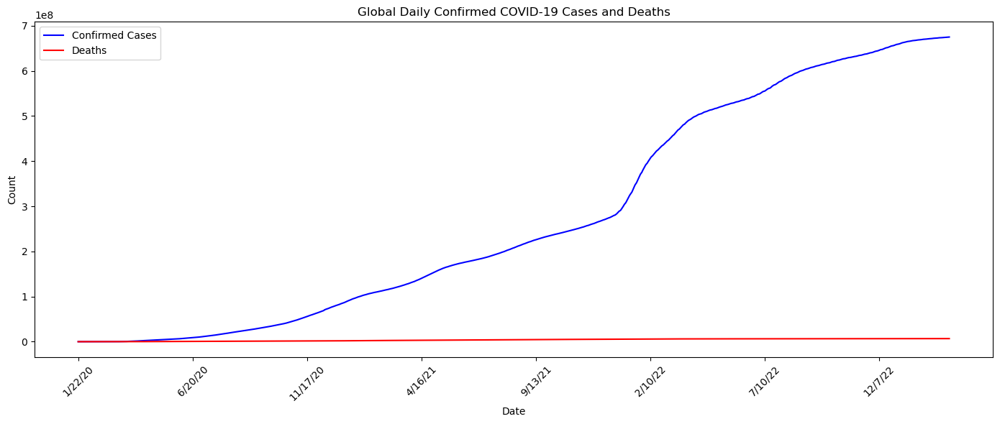
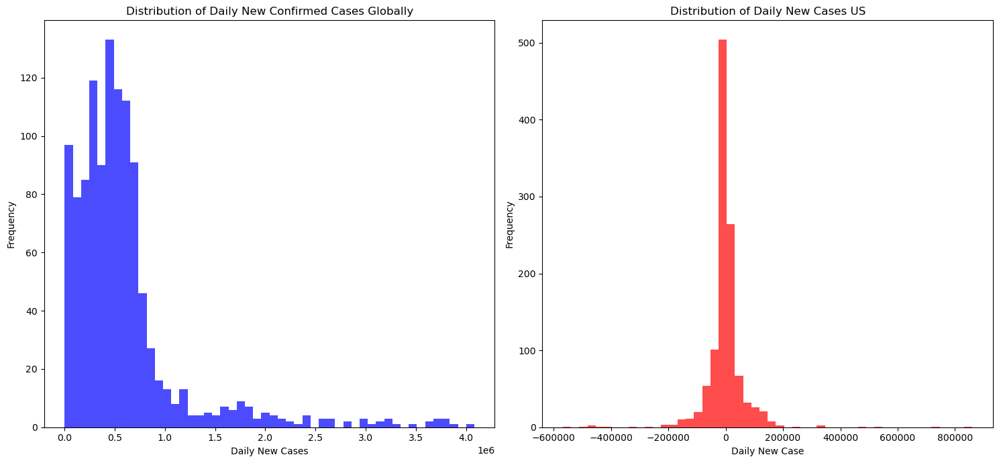
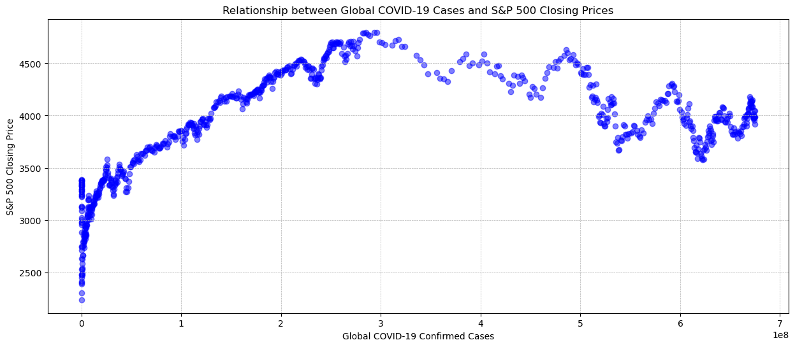
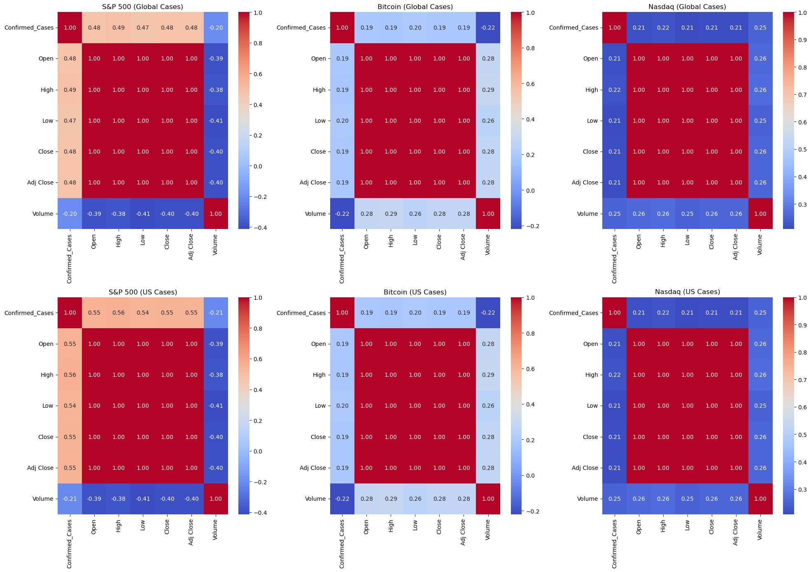
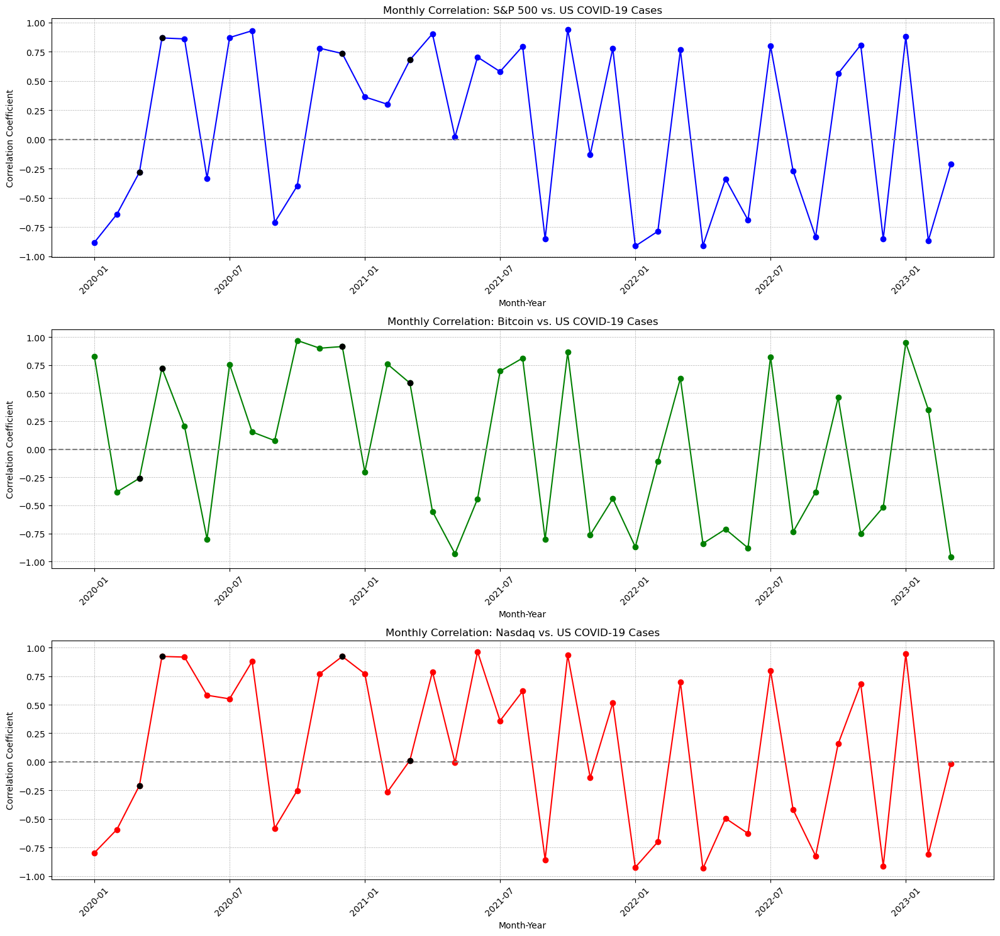
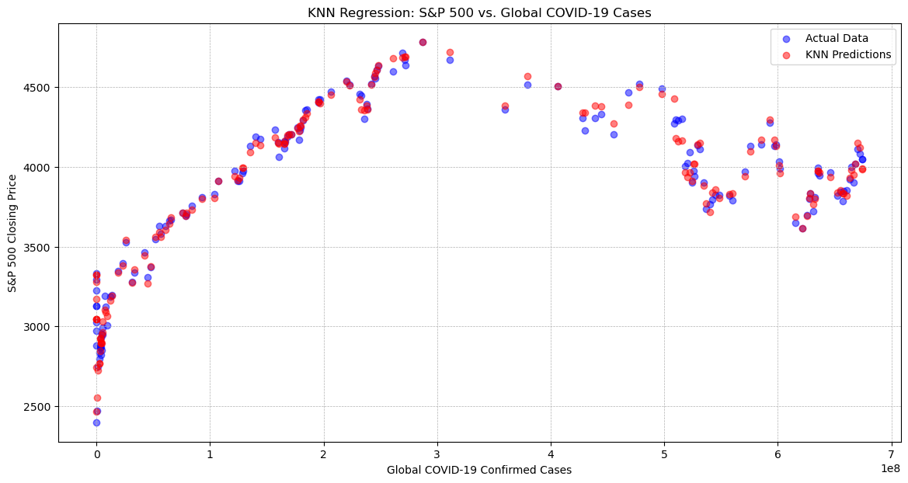

# Question to answer

- Is there a correlation between the number of COVID-19 cases and stock market (SP500 && Nasdaq indices) across different countries?

- Have US government stimulus packages had a positive impact on stock market indices?

- USA && world - SP500 && Nasdaq - Bitcoin

---

# Reflective Report on Portfolio 4

## Introduction

This report encapsulates the exploration journey undertaken in Portfolio 4 of the [Data Science Study Practices](https://github.com/richhann/Data-Science-Study-Practices/tree/portfolio-part-4-richhann) on GitHub. The focal point of this project was to unravel the economic ramifications of COVID-19, its linkage with stock market oscillations, specifically zooming into Bitcoin and S&P 500 indices, and the influence of USA governmental stimulus packages on these markets.

## Problem Solving and Learning

The project posed a multi-faceted challenge, encompassing data procurement from diverse sources, handling missing or incomplete data, and aligning the data chronologically to reflect accurate trends. Through rigorous data preparation and exploration, I honed my skills in variable identification, univariate and bivariate analysis, which were pivotal in the subsequent analysis phase.

## Progression and Future Interests

The progression from the onset of this unit to the culmination of Portfolio 4 has been enriching. The project not only fortified my data analysis acumen but also spurred a keen interest in economic data analysis, which I am eager to delve into deeper in future projects.

## Discussion Points

### Dataset Choice
The datasets encompassed stock market data from Yahoo Finance and Wall Street Journal, Bitcoin data from Yahoo Finance, COVID-19 data from Kaggle or World Health Organization, and Government Stimulus Packages data from Investopedia. These were instrumental in constructing a well-rounded analysis of the economic landscape during the COVID-19 pandemic.

### Problem Identification
The project sought to answer well-defined questions concerning the global economic impact of COVID-19, the correlation between COVID-19 cases and stock market indices, the effect of government stimulus packages on stock market indices and Bitcoin prices, and the correlation between stimulus packages' release timelines with Bitcoin and S&P 500 indices.

### Model Selection
Employing Correlation Analysis, Time Series Analysis, and Regression Analysis was pivotal in dissecting the relationships between the variables and predicting the impact of various factors on stock market indices and Bitcoin prices.

### Insights and Conclusions
The juxtaposition of Bitcoin versus S&P 500 unveiled nuanced insights into market behaviors in response to governmental economic interventions during the pandemic. The correlation analysis between stimulus packages, Bitcoin, and the S&P 500 offered a lens into different market reactions, thus fulfilling the objective of providing a thorough analysis addressing the core requisites of the project.

## Additional Points
The project underscored the significance of a structured analysis framework, clear documentation, and the power of visualization in conveying complex data insights. The endeavor into creating interactive dashboards for deeper data exploration was a learning curve that added a robust dimension to the analysis.

---
https://www.kaggle.com/datasets/mczielinski/bitcoin-historical-data
    
 #   Bitcoin 
    
    COVID-19 has its huge impact on the economy. Can you show the global economic impact of corona virus?
    Can you find any relationship between stocks and COVID-19 confirmed cases around the world?
    Do stimulus packages by governments have any positive impact on stocks?
    
    (stimulus packages vs bitcoin should have stronger correlations ,more visible, as stocks may be impacted due to the company's profitability and dividend yield,
    
    however bitcoin is almost purely due to investors confidence, thus this report will be focused on Bitcoin vs SP&500 vs US stimulus package drop timeframe
    
    Stimulus and Relief (US)
    
    - Package 1 signed into law on March 6, 2020, 8.3 Billion
    
    - Package 2 March 18, 2020, 1 Billion, paid sick leave + free test
    
    - Package 3 March 27, 2020 largest relief package (Additional 600 USD/week)
    
    - Package 3.5 April 24, 2020
    
    - Package 4 Dec. 21, 2020, 900 billion stimulus
    
    - Package 5 March 11, 2021 implementing a 1.9 trillion package
    
    Federal stimulus checks were discontinued for 2022.
    
    TIMEFRAME (Jan 22 2020 - Jan 22 2022 , cut off date Sep 03 2023)
    


```python
end_date = "12/31/22"

# Stimulus package dates and descriptions

stimulus_dates = ["3/6/20", "3/18/20", "3/27/20", "4/24/20", "12/21/20", "3/11/21"]
stimulus_descriptions = [
    "Package 1 ($8.3B)",
    "Package 2 ($1B + Paid Sick Leave)",
    "Package 3 ($600/week)",
    "Package 3.5",
    "Package 4 ($900B)",
    "Package 5 ($1.9T)"
]
```

# Table of Contents

Is there a correlation between the number of COVID-19 cases and stock market (SP500 && Nasdaq indices) across different countries?

Have US government stimulus packages had a positive impact on stock market indices?

USA && world - SP500 && Nasdaq - Bitcoin 

**Exploration:** 

- Variable Identification: Identify the variables within each dataset and their types.

- Univariate Analysis: Analyze single variables to understand their distribution and potential impact.

- Bivariate Analysis: Analyze the relationships between COVID-19 cases, stock market indices, and stimulus packages.

- Missing Value Treatment: Handle missing or incomplete data to ensure accuracy in analysis.

**Analysis/Prediction Techniques:**

- Correlation Analysis: Assess the correlation between COVID-19 cases and stock market indices.

- Time Series Analysis: Explore stock market trends over time and relate them to major COVID-19 events or stimulus package announcements.

- Regression Analysis: Determine the impact of various factors on stock market indices.

- Clustering and Classification: Identify patterns or groups within the data that share common characteristics.

**Visualization:**

- Visualize the global economic impact of COVID-19 using geographic heatmaps or time-series plots.

- Utilize scatter plots or line charts to visualize the correlation between COVID-19 cases and stock market indices.

- Use bar graphs to visualize the impact of stimulus packages on stock markets.
Create interactive dashboards that allow for a deeper exploration of data and insights.

**Evaluation:**

- Evaluate the accuracy and effectiveness of your models using metrics like MSE, MAE, R-squared for regression problems, and accuracy, F-score, AUC for classification problems.

- Compare the performance of simpler models with more complex models to show improvement.

- Conduct parameter analysis to optimize model performance, e.g., tuning the k parameter in KNN algorithm.


```python
# import given package 
import pandas as pd 
import numpy as np 
import seaborn as sns
import matplotlib.pyplot as plt 
import pandas_datareader as pdr
import yfinance as yf

import datetime as dt


# global covid case and death, vs US... see correlation
covidCase_global_url = "https://raw.githubusercontent.com/CSSEGISandData/COVID-19/master/csse_covid_19_data/csse_covid_19_time_series/time_series_covid19_confirmed_global.csv"
covidCase_g_df = pd.read_csv(covidCase_global_url)


covidDeath_global_url = "https://raw.githubusercontent.com/CSSEGISandData/COVID-19/master/csse_covid_19_data/csse_covid_19_time_series/time_series_covid19_deaths_global.csv"
covidDeath_g_df = pd.read_csv(covidDeath_global_url)

covidCase_g_df.head(1)

```


<div>
<style scoped>
    .dataframe tbody tr th:only-of-type {
        vertical-align: middle;
    }

    .dataframe tbody tr th {
        vertical-align: top;
    }

    .dataframe thead th {
        text-align: right;
    }
</style>
<table border="1" class="dataframe">
  <thead>
    <tr style="text-align: right;">
      <th></th>
      <th>Province/State</th>
      <th>Country/Region</th>
      <th>Lat</th>
      <th>Long</th>
      <th>1/22/20</th>
      <th>1/23/20</th>
      <th>1/24/20</th>
      <th>1/25/20</th>
      <th>1/26/20</th>
      <th>1/27/20</th>
      <th>...</th>
      <th>2/28/23</th>
      <th>3/1/23</th>
      <th>3/2/23</th>
      <th>3/3/23</th>
      <th>3/4/23</th>
      <th>3/5/23</th>
      <th>3/6/23</th>
      <th>3/7/23</th>
      <th>3/8/23</th>
      <th>3/9/23</th>
    </tr>
  </thead>
  <tbody>
    <tr>
      <th>0</th>
      <td>NaN</td>
      <td>Afghanistan</td>
      <td>33.93911</td>
      <td>67.709953</td>
      <td>0</td>
      <td>0</td>
      <td>0</td>
      <td>0</td>
      <td>0</td>
      <td>0</td>
      <td>...</td>
      <td>209322</td>
      <td>209340</td>
      <td>209358</td>
      <td>209362</td>
      <td>209369</td>
      <td>209390</td>
      <td>209406</td>
      <td>209436</td>
      <td>209451</td>
      <td>209451</td>
    </tr>
  </tbody>
</table>
<p>1 rows × 1147 columns</p>
</div>


# Exploration:


```python

# shape check

print(covidCase_g_df.shape)

print(covidCase_g_df.columns)
```

    (289, 1147)
    Index(['Province/State', 'Country/Region', 'Lat', 'Long', '1/22/20', '1/23/20',
           '1/24/20', '1/25/20', '1/26/20', '1/27/20',
           ...
           '2/28/23', '3/1/23', '3/2/23', '3/3/23', '3/4/23', '3/5/23', '3/6/23',
           '3/7/23', '3/8/23', '3/9/23'],
          dtype='object', length=1147)
    


```python
covidCase_g_df.head()
```


<div>
<style scoped>
    .dataframe tbody tr th:only-of-type {
        vertical-align: middle;
    }

    .dataframe tbody tr th {
        vertical-align: top;
    }

    .dataframe thead th {
        text-align: right;
    }
</style>
<table border="1" class="dataframe">
  <thead>
    <tr style="text-align: right;">
      <th></th>
      <th>Province/State</th>
      <th>Country/Region</th>
      <th>Lat</th>
      <th>Long</th>
      <th>1/22/20</th>
      <th>1/23/20</th>
      <th>1/24/20</th>
      <th>1/25/20</th>
      <th>1/26/20</th>
      <th>1/27/20</th>
      <th>...</th>
      <th>2/28/23</th>
      <th>3/1/23</th>
      <th>3/2/23</th>
      <th>3/3/23</th>
      <th>3/4/23</th>
      <th>3/5/23</th>
      <th>3/6/23</th>
      <th>3/7/23</th>
      <th>3/8/23</th>
      <th>3/9/23</th>
    </tr>
  </thead>
  <tbody>
    <tr>
      <th>0</th>
      <td>NaN</td>
      <td>Afghanistan</td>
      <td>33.93911</td>
      <td>67.709953</td>
      <td>0</td>
      <td>0</td>
      <td>0</td>
      <td>0</td>
      <td>0</td>
      <td>0</td>
      <td>...</td>
      <td>209322</td>
      <td>209340</td>
      <td>209358</td>
      <td>209362</td>
      <td>209369</td>
      <td>209390</td>
      <td>209406</td>
      <td>209436</td>
      <td>209451</td>
      <td>209451</td>
    </tr>
    <tr>
      <th>1</th>
      <td>NaN</td>
      <td>Albania</td>
      <td>41.15330</td>
      <td>20.168300</td>
      <td>0</td>
      <td>0</td>
      <td>0</td>
      <td>0</td>
      <td>0</td>
      <td>0</td>
      <td>...</td>
      <td>334391</td>
      <td>334408</td>
      <td>334408</td>
      <td>334427</td>
      <td>334427</td>
      <td>334427</td>
      <td>334427</td>
      <td>334427</td>
      <td>334443</td>
      <td>334457</td>
    </tr>
    <tr>
      <th>2</th>
      <td>NaN</td>
      <td>Algeria</td>
      <td>28.03390</td>
      <td>1.659600</td>
      <td>0</td>
      <td>0</td>
      <td>0</td>
      <td>0</td>
      <td>0</td>
      <td>0</td>
      <td>...</td>
      <td>271441</td>
      <td>271448</td>
      <td>271463</td>
      <td>271469</td>
      <td>271469</td>
      <td>271477</td>
      <td>271477</td>
      <td>271490</td>
      <td>271494</td>
      <td>271496</td>
    </tr>
    <tr>
      <th>3</th>
      <td>NaN</td>
      <td>Andorra</td>
      <td>42.50630</td>
      <td>1.521800</td>
      <td>0</td>
      <td>0</td>
      <td>0</td>
      <td>0</td>
      <td>0</td>
      <td>0</td>
      <td>...</td>
      <td>47866</td>
      <td>47875</td>
      <td>47875</td>
      <td>47875</td>
      <td>47875</td>
      <td>47875</td>
      <td>47875</td>
      <td>47875</td>
      <td>47890</td>
      <td>47890</td>
    </tr>
    <tr>
      <th>4</th>
      <td>NaN</td>
      <td>Angola</td>
      <td>-11.20270</td>
      <td>17.873900</td>
      <td>0</td>
      <td>0</td>
      <td>0</td>
      <td>0</td>
      <td>0</td>
      <td>0</td>
      <td>...</td>
      <td>105255</td>
      <td>105277</td>
      <td>105277</td>
      <td>105277</td>
      <td>105277</td>
      <td>105277</td>
      <td>105277</td>
      <td>105277</td>
      <td>105288</td>
      <td>105288</td>
    </tr>
  </tbody>
</table>
<p>5 rows × 1147 columns</p>
</div>


```python
# Drop rows with missing Lat and Long values for simplicity
covidCase_g_df.dropna(subset=['Lat', 'Long'], inplace=True)
covidDeath_g_df.dropna(subset=['Lat', 'Long'], inplace=True)

# Re-aggregate data to get a global daily summary after dropping missing values
global_cases_daily = covidCase_g_df.iloc[:, 4:].sum()
global_deaths_daily = covidDeath_g_df.iloc[:, 4:].sum()

# Basic exploration of the aggregated global daily summary
summary = {
    "Total Confirmed Cases": global_cases_daily[-1],
    "Total Deaths": global_deaths_daily[-1],
    "Cases on Last Day": global_cases_daily[-1] - global_cases_daily[-2],
    "Deaths on Last Day": global_deaths_daily[-1] - global_deaths_daily[-2]
}

summary

```


    {'Total Confirmed Cases': 675048320,
     'Total Deaths': 6799607,
     'Cases on Last Day': 177325,
     'Deaths on Last Day': 1319}


```python
# Correlation Analysis between confirmed cases and deaths
correlation = global_cases_daily.corr(global_deaths_daily)

# Time Series Visualization of global daily confirmed cases and deaths
import matplotlib.pyplot as plt

plt.figure(figsize=(14, 6))

plt.plot(global_cases_daily.index, global_cases_daily, label='Confirmed Cases', color='blue')
plt.plot(global_deaths_daily.index, global_deaths_daily, label='Deaths', color='red')
plt.title('Global Daily Confirmed COVID-19 Cases and Deaths')
plt.xlabel('Date')
plt.ylabel('Count')

# Adjusting date ticks for better readability
plt.xticks(global_cases_daily.index[::150], rotation=45)
plt.tight_layout()

plt.legend()

plt.show()


correlation

```


    

    


    0.9392530175025038


```python
# Extract US-only data for confirmed COVID-19 cases
us_cases = covidCase_g_df[covidCase_g_df['Country/Region'] == 'US'].iloc[:, 4:].sum()

# Plotting Global and US data for comparison
plt.figure(figsize=(15, 7))

# Global Data
plt.plot(global_cases_daily.index, global_cases_daily, label='Global Confirmed Cases', color='blue')

# US Data
plt.plot(us_cases.index, us_cases, label='US Confirmed Cases', color='green', linestyle='--')

# Title and labels
plt.title('Comparison of Global and US Daily Confirmed COVID-19 Cases')
plt.xlabel('Date')
plt.ylabel('Count')
plt.xticks(us_cases.index[::150], rotation=45)
plt.tight_layout()
plt.legend()

plt.show()

```


    

    


#### Covid cases
global COVID-19 data from January 22, 2020, to March 9, 2023, reveals a consistent and strong correlation between confirmed cases and deaths.

Death count will be ignored from this point. Due to the high correlation 0.939, will result in almost identical relationship.

**Univariate Analysis** of the global next to US daily confirmed cases to understand their distributions.


```python
# Calculate daily new confirmed cases globally

daily_new_cases = global_cases_daily.diff().dropna()
us_cases_diff = us_cases.diff().dropna()

plt.figure(figsize=(15, 7))

# Plotting daily new confirmed cases
plt.subplot(1, 2, 1)
plt.hist(daily_new_cases, bins=50, color='blue', alpha=0.7)
plt.title('Distribution of Daily New Confirmed Cases Globally')
plt.xlabel('Daily New Cases')
plt.ylabel('Frequency')


plt.subplot(1, 2, 2)
plt.hist(us_cases_diff, bins=50, color='red', alpha=0.7)
plt.title('Distribution of Daily New Cases US')
plt.xlabel('Daily New Case')
plt.ylabel('Frequency')

plt.tight_layout()
plt.show()


```


    

    


Both Daily Confirmed Cases is **right-skewed**, indicating that there were several days with a very high spikes of new cases, but most days had a relatively lower number of new cases.


```python
nasdaq_df = pd.read_csv("Data/Nasdaq.csv")
nasdaq_df['Date'] = pd.to_datetime(nasdaq_df['Date']).dt.strftime('%m/%d/%y')
nasdaq_df.tail(1)
```


<div>
<style scoped>
    .dataframe tbody tr th:only-of-type {
        vertical-align: middle;
    }

    .dataframe tbody tr th {
        vertical-align: top;
    }

    .dataframe thead th {
        text-align: right;
    }
</style>
<table border="1" class="dataframe">
  <thead>
    <tr style="text-align: right;">
      <th></th>
      <th>Date</th>
      <th>Open</th>
      <th>High</th>
      <th>Low</th>
      <th>Close</th>
      <th>Adj Close</th>
      <th>Volume</th>
    </tr>
  </thead>
  <tbody>
    <tr>
      <th>910</th>
      <td>09/01/23</td>
      <td>14129.959961</td>
      <td>14149.620117</td>
      <td>13982.419922</td>
      <td>14031.80957</td>
      <td>14031.80957</td>
      <td>4033960000</td>
    </tr>
  </tbody>
</table>
</div>


```python
btc_usd_df = pd.read_csv("Data/BTC-USD.csv")
btc_usd_df['Date'] = pd.to_datetime(btc_usd_df['Date']).dt.strftime('%m/%d/%y')
btc_usd_df.tail(1)
```


<div>
<style scoped>
    .dataframe tbody tr th:only-of-type {
        vertical-align: middle;
    }

    .dataframe tbody tr th {
        vertical-align: top;
    }

    .dataframe thead th {
        text-align: right;
    }
</style>
<table border="1" class="dataframe">
  <thead>
    <tr style="text-align: right;">
      <th></th>
      <th>Date</th>
      <th>Open</th>
      <th>High</th>
      <th>Low</th>
      <th>Close</th>
      <th>Adj Close</th>
      <th>Volume</th>
    </tr>
  </thead>
  <tbody>
    <tr>
      <th>1318</th>
      <td>09/01/23</td>
      <td>25934.021484</td>
      <td>26125.869141</td>
      <td>25362.609375</td>
      <td>25800.724609</td>
      <td>25800.724609</td>
      <td>17202862221</td>
    </tr>
  </tbody>
</table>
</div>


```python
sp500_df = pd.read_csv("Data/SP500.csv")
sp500_df['Date'] = pd.to_datetime(sp500_df['Date']).dt.strftime('%m/%d/%y')
sp500_df.head(1)
```


<div>
<style scoped>
    .dataframe tbody tr th:only-of-type {
        vertical-align: middle;
    }

    .dataframe tbody tr th {
        vertical-align: top;
    }

    .dataframe thead th {
        text-align: right;
    }
</style>
<table border="1" class="dataframe">
  <thead>
    <tr style="text-align: right;">
      <th></th>
      <th>Date</th>
      <th>Open</th>
      <th>High</th>
      <th>Low</th>
      <th>Close</th>
      <th>Adj Close</th>
      <th>Volume</th>
    </tr>
  </thead>
  <tbody>
    <tr>
      <th>0</th>
      <td>01/22/20</td>
      <td>3330.02002</td>
      <td>3337.77002</td>
      <td>3320.040039</td>
      <td>3321.75</td>
      <td>3321.75</td>
      <td>3623780000</td>
    </tr>
  </tbody>
</table>
</div>


### Bivariate Analysis


```python
# Preparing the COVID-19 data
covid_df = global_cases_daily.reset_index()
covid_df.columns = ['Date', 'Confirmed_Cases']
covid_df['Date'] = pd.to_datetime(covid_df['Date'], format='%m/%d/%y')


# Preparing the S&P 500 data
sp500_df['Date'] = pd.to_datetime(sp500_df['Date'], format='%m/%d/%y')

# Merging the two datasets on the date
merged_sp500_covid = pd.merge(covid_df, sp500_df, on='Date', how='inner')

# Displaying the first few rows of the merged dataset
merged_sp500_covid.head()

```


<div>
<style scoped>
    .dataframe tbody tr th:only-of-type {
        vertical-align: middle;
    }

    .dataframe tbody tr th {
        vertical-align: top;
    }

    .dataframe thead th {
        text-align: right;
    }
</style>
<table border="1" class="dataframe">
  <thead>
    <tr style="text-align: right;">
      <th></th>
      <th>Date</th>
      <th>Confirmed_Cases</th>
      <th>Open</th>
      <th>High</th>
      <th>Low</th>
      <th>Close</th>
      <th>Adj Close</th>
      <th>Volume</th>
    </tr>
  </thead>
  <tbody>
    <tr>
      <th>0</th>
      <td>2020-01-22</td>
      <td>557</td>
      <td>3330.020020</td>
      <td>3337.770020</td>
      <td>3320.040039</td>
      <td>3321.750000</td>
      <td>3321.750000</td>
      <td>3623780000</td>
    </tr>
    <tr>
      <th>1</th>
      <td>2020-01-23</td>
      <td>657</td>
      <td>3315.770020</td>
      <td>3326.879883</td>
      <td>3301.870117</td>
      <td>3325.540039</td>
      <td>3325.540039</td>
      <td>3766710000</td>
    </tr>
    <tr>
      <th>2</th>
      <td>2020-01-24</td>
      <td>944</td>
      <td>3333.100098</td>
      <td>3333.179932</td>
      <td>3281.530029</td>
      <td>3295.469971</td>
      <td>3295.469971</td>
      <td>3708780000</td>
    </tr>
    <tr>
      <th>3</th>
      <td>2020-01-27</td>
      <td>2929</td>
      <td>3247.159912</td>
      <td>3258.850098</td>
      <td>3234.500000</td>
      <td>3243.629883</td>
      <td>3243.629883</td>
      <td>3831050000</td>
    </tr>
    <tr>
      <th>4</th>
      <td>2020-01-28</td>
      <td>5580</td>
      <td>3255.350098</td>
      <td>3285.780029</td>
      <td>3253.219971</td>
      <td>3276.239990</td>
      <td>3276.239990</td>
      <td>3531570000</td>
    </tr>
  </tbody>
</table>
</div>


```python
import matplotlib.pyplot as plt

plt.figure(figsize=(15, 6))

# Plotting the relationship
plt.scatter(merged_sp500_covid['Confirmed_Cases'], merged_sp500_covid['Close'], color='blue', alpha=0.5)

# Title and labels
plt.title('Relationship between Global COVID-19 Cases and S&P 500 Closing Prices')
plt.xlabel('Global COVID-19 Confirmed Cases')
plt.ylabel('S&P 500 Closing Price')
plt.grid(True, which='both', linestyle='--', linewidth=0.5)

plt.show()

```


    

    


should have no missing values but check anyways


```python
# Checking for missing values in the merged dataset
missing_values = merged_sp500_covid.isnull().sum()

missing_values

```


    Date               0
    Confirmed_Cases    0
    Open               0
    High               0
    Low                0
    Close              0
    Adj Close          0
    Volume             0
    dtype: int64


```python
# Preparing the Bitcoin data
btc_usd_df['Date'] = pd.to_datetime(btc_usd_df['Date'], format='%m/%d/%y')

# Merging the COVID-19 data with the Bitcoin data
merged_btc_covid = pd.merge(covid_df, btc_usd_df, on='Date', how='inner')

# Checking for missing values in the merged dataset
missing_values_btc = merged_btc_covid.isnull().sum()

missing_values_btc

```


    Date               0
    Confirmed_Cases    0
    Open               0
    High               0
    Low                0
    Close              0
    Adj Close          0
    Volume             0
    dtype: int64


```python
# Plotting all three relationships side-by-side

fig, ax = plt.subplots(nrows=1, ncols=3, figsize=(20, 6))

# S&P 500 vs. COVID-19 Cases
ax[0].scatter(merged_sp500_covid['Confirmed_Cases'], merged_sp500_covid['Close'], color='blue', alpha=0.5)
ax[0].set_title('S&P 500 vs. COVID-19 Cases')
ax[0].set_xlabel('Global COVID-19 Confirmed Cases')
ax[0].set_ylabel('S&P 500 Closing Price')
ax[0].grid(True, which='both', linestyle='--', linewidth=0.5)

# Bitcoin-USD vs. COVID-19 Cases
ax[1].scatter(merged_btc_covid['Confirmed_Cases'], merged_btc_covid['Close'], color='green', alpha=0.5)
ax[1].set_title('Bitcoin-USD vs. COVID-19 Cases')
ax[1].set_xlabel('Global COVID-19 Confirmed Cases')
ax[1].set_ylabel('Bitcoin-USD Closing Price')
ax[1].grid(True, which='both', linestyle='--', linewidth=0.5)

# Nasdaq vs. COVID-19 Cases
ax[2].scatter(merged_nasdaq_covid['Confirmed_Cases'], merged_nasdaq_covid['Close'], color='red', alpha=0.5)
ax[2].set_title('Nasdaq vs. COVID-19 Cases')
ax[2].set_xlabel('Global COVID-19 Confirmed Cases')
ax[2].set_ylabel('Nasdaq Closing Price')
ax[2].grid(True, which='both', linestyle='--', linewidth=0.5)

# Adjusting layout
plt.tight_layout()
plt.show()

```


    

    


```python
# Preparing the COVID-19 data for the US
covidUS_df = us_cases.reset_index()
covidUS_df.columns = ['Date', 'Confirmed_Cases']
covidUS_df['Date'] = pd.to_datetime(covidUS_df['Date'], format='%m/%d/%y')

# Merging the US COVID-19 data with the financial datasets

# Merging with S&P 500 data
merged_sp500_us_covid = pd.merge(covidUS_df, sp500_df, on='Date', how='inner')

# Merging with Bitcoin data
merged_btc_us_covid = pd.merge(covidUS_df, btc_usd_df, on='Date', how='inner')

# Merging with Nasdaq data
merged_nasdaq_us_covid = pd.merge(covidUS_df, nasdaq_df, on='Date', how='inner')

# Plotting the relationships for US COVID-19 Cases

fig, ax = plt.subplots(nrows=1, ncols=3, figsize=(20, 6))

# S&P 500 vs. US COVID-19 Cases
ax[0].scatter(merged_sp500_us_covid['Confirmed_Cases'], merged_sp500_us_covid['Close'], color='blue', alpha=0.5)
ax[0].set_title('S&P 500 vs. US COVID-19 Cases')
ax[0].set_xlabel('US COVID-19 Confirmed Cases')
ax[0].set_ylabel('S&P 500 Closing Price')
ax[0].grid(True, which='both', linestyle='--', linewidth=0.5)

# Bitcoin-USD vs. US COVID-19 Cases
ax[1].scatter(merged_btc_us_covid['Confirmed_Cases'], merged_btc_us_covid['Close'], color='green', alpha=0.5)
ax[1].set_title('Bitcoin-USD vs. US COVID-19 Cases')
ax[1].set_xlabel('US COVID-19 Confirmed Cases')
ax[1].set_ylabel('Bitcoin-USD Closing Price')
ax[1].grid(True, which='both', linestyle='--', linewidth=0.5)

# Nasdaq vs. US COVID-19 Cases
ax[2].scatter(merged_nasdaq_us_covid['Confirmed_Cases'], merged_nasdaq_us_covid['Close'], color='red', alpha=0.5)
ax[2].set_title('Nasdaq vs. US COVID-19 Cases')
ax[2].set_xlabel('US COVID-19 Confirmed Cases')
ax[2].set_ylabel('Nasdaq Closing Price')
ax[2].grid(True, which='both', linestyle='--', linewidth=0.5)

# Adjusting layout
plt.tight_layout()
plt.show()

```


    

    


Visually samiliar SP500 and Nasdaq, how dense the dots represent the amount of confirmed cases and how exponentional is the spread, 
from eye balling Nasdaq and SP500 once the growth became faster 0.5 to 0.8 the stock revealed a downward trend (inverse relationship)As the number of cases increased, the S&P 500 index generally trended downwards.

However **bitcoin**, seem to have a stronger positive relationship as predicted. There's a dense cluster of data points indicating stability during certain periods, but as the number of cases increased, the volatility in Bitcoin's price also increased, suggesting a stronger positive correlation in those periods.

### Correlation Matrix


```python
# Initialize the us_cases_df again by filtering the original dataset for US data
us_cases_df = covidCase_g_df[covidCase_g_df['Country/Region'] == 'US']

# Recreate the transposed US COVID-19 data as a DataFrame
us_cases_transposed = us_cases_df.drop(columns=['Province/State', 'Country/Region', 'Lat', 'Long']).T
us_cases_transposed = us_cases_transposed.rename(columns={us_cases_transposed.columns[0]: 'Confirmed_Cases'}).reset_index()
us_cases_transposed = us_cases_transposed.rename(columns={'index': 'Date'})
us_cases_transposed['Date'] = pd.to_datetime(us_cases_transposed['Date'], format='%m/%d/%y')

covidUS_df = us_cases_transposed.set_index('Date').transpose()

covidUS_df.head()

```


<div>
<style scoped>
    .dataframe tbody tr th:only-of-type {
        vertical-align: middle;
    }

    .dataframe tbody tr th {
        vertical-align: top;
    }

    .dataframe thead th {
        text-align: right;
    }
</style>
<table border="1" class="dataframe">
  <thead>
    <tr style="text-align: right;">
      <th>Date</th>
      <th>2020-01-22</th>
      <th>2020-01-23</th>
      <th>2020-01-24</th>
      <th>2020-01-25</th>
      <th>2020-01-26</th>
      <th>2020-01-27</th>
      <th>2020-01-28</th>
      <th>2020-01-29</th>
      <th>2020-01-30</th>
      <th>2020-01-31</th>
      <th>...</th>
      <th>2023-02-28</th>
      <th>2023-03-01</th>
      <th>2023-03-02</th>
      <th>2023-03-03</th>
      <th>2023-03-04</th>
      <th>2023-03-05</th>
      <th>2023-03-06</th>
      <th>2023-03-07</th>
      <th>2023-03-08</th>
      <th>2023-03-09</th>
    </tr>
  </thead>
  <tbody>
    <tr>
      <th>Confirmed_Cases</th>
      <td>1</td>
      <td>1</td>
      <td>2</td>
      <td>2</td>
      <td>5</td>
      <td>5</td>
      <td>5</td>
      <td>6</td>
      <td>6</td>
      <td>8</td>
      <td>...</td>
      <td>103443455</td>
      <td>103533872</td>
      <td>103589757</td>
      <td>103648690</td>
      <td>103650837</td>
      <td>103646975</td>
      <td>103655539</td>
      <td>103690910</td>
      <td>103755771</td>
      <td>103802702</td>
    </tr>
  </tbody>
</table>
<p>1 rows × 1143 columns</p>
</div>


```python
import seaborn as sns

# Compute the correlation matrices
correlation_matrices = {
    'S&P 500 (Global Cases)': merged_sp500_covid.corr(),
    'Bitcoin (Global Cases)': merged_btc_covid.corr(),
    'Nasdaq (Global Cases)': merged_nasdaq_covid.corr(),
    'S&P 500 (US Cases)': merged_sp500_us_covid.corr(),
    'Bitcoin (US Cases)': merged_btc_us_covid.corr(),
    'Nasdaq (US Cases)': merged_nasdaq_us_covid.corr()
}

# Visualizing the correlation matrices
fig, axes = plt.subplots(nrows=2, ncols=3, figsize=(20, 14))

for ax, (title, matrix) in zip(axes.flatten(), correlation_matrices.items()):
    sns.heatmap(matrix, annot=True, fmt=".2f", cmap='coolwarm', ax=ax)
    ax.set_title(title)

plt.tight_layout()
plt.show()

```

    C:\Users\mingy\AppData\Local\Temp\ipykernel_18736\6020210.py:5: FutureWarning: The default value of numeric_only in DataFrame.corr is deprecated. In a future version, it will default to False. Select only valid columns or specify the value of numeric_only to silence this warning.
      'S&P 500 (Global Cases)': merged_sp500_covid.corr(),
    C:\Users\mingy\AppData\Local\Temp\ipykernel_18736\6020210.py:6: FutureWarning: The default value of numeric_only in DataFrame.corr is deprecated. In a future version, it will default to False. Select only valid columns or specify the value of numeric_only to silence this warning.
      'Bitcoin (Global Cases)': merged_btc_covid.corr(),
    C:\Users\mingy\AppData\Local\Temp\ipykernel_18736\6020210.py:7: FutureWarning: The default value of numeric_only in DataFrame.corr is deprecated. In a future version, it will default to False. Select only valid columns or specify the value of numeric_only to silence this warning.
      'Nasdaq (Global Cases)': merged_nasdaq_covid.corr(),
    C:\Users\mingy\AppData\Local\Temp\ipykernel_18736\6020210.py:8: FutureWarning: The default value of numeric_only in DataFrame.corr is deprecated. In a future version, it will default to False. Select only valid columns or specify the value of numeric_only to silence this warning.
      'S&P 500 (US Cases)': merged_sp500_us_covid.corr(),
    C:\Users\mingy\AppData\Local\Temp\ipykernel_18736\6020210.py:9: FutureWarning: The default value of numeric_only in DataFrame.corr is deprecated. In a future version, it will default to False. Select only valid columns or specify the value of numeric_only to silence this warning.
      'Bitcoin (US Cases)': merged_btc_us_covid.corr(),
    C:\Users\mingy\AppData\Local\Temp\ipykernel_18736\6020210.py:10: FutureWarning: The default value of numeric_only in DataFrame.corr is deprecated. In a future version, it will default to False. Select only valid columns or specify the value of numeric_only to silence this warning.
      'Nasdaq (US Cases)': merged_nasdaq_us_covid.corr()
    


    

    


```python
# Segmenting the data into monthly blocks and computing the correlation for each month
# thought process... news of stimulus gets released + or - a week or two time for news to spread and market to react

# Extracting month and year from Date for grouping purposes
merged_sp500_us_covid['MonthYear'] = merged_sp500_us_covid['Date'].dt.to_period('M')
merged_btc_us_covid['MonthYear'] = merged_btc_us_covid['Date'].dt.to_period('M')
merged_nasdaq_us_covid['MonthYear'] = merged_nasdaq_us_covid['Date'].dt.to_period('M')

# Grouping by month and computing correlation for each month
correlations_sp500 = merged_sp500_us_covid.groupby('MonthYear').apply(lambda x: x['Confirmed_Cases'].corr(x['Close']))
correlations_btc = merged_btc_us_covid.groupby('MonthYear').apply(lambda x: x['Confirmed_Cases'].corr(x['Close']))
correlations_nasdaq = merged_nasdaq_us_covid.groupby('MonthYear').apply(lambda x: x['Confirmed_Cases'].corr(x['Close']))

# Combining the correlations into a DataFrame for visualization
correlations_df = pd.DataFrame({
    'S&P 500': correlations_sp500,
    'Bitcoin': correlations_btc,
    'Nasdaq': correlations_nasdaq
})

correlations_df.reset_index(inplace=True)

# Highlighting the months with stimulus packages
stimulus_month_years = pd.to_datetime(stimulus_dates).to_period('M')
correlations_df['Stimulus'] = correlations_df['MonthYear'].isin(stimulus_month_years)

correlations_df

```


<div>
<style scoped>
    .dataframe tbody tr th:only-of-type {
        vertical-align: middle;
    }

    .dataframe tbody tr th {
        vertical-align: top;
    }

    .dataframe thead th {
        text-align: right;
    }
</style>
<table border="1" class="dataframe">
  <thead>
    <tr style="text-align: right;">
      <th></th>
      <th>MonthYear</th>
      <th>S&amp;P 500</th>
      <th>Bitcoin</th>
      <th>Nasdaq</th>
      <th>Stimulus</th>
    </tr>
  </thead>
  <tbody>
    <tr>
      <th>0</th>
      <td>2020-01</td>
      <td>-0.882669</td>
      <td>0.826701</td>
      <td>-0.795648</td>
      <td>False</td>
    </tr>
    <tr>
      <th>1</th>
      <td>2020-02</td>
      <td>-0.640431</td>
      <td>-0.382152</td>
      <td>-0.591169</td>
      <td>False</td>
    </tr>
    <tr>
      <th>2</th>
      <td>2020-03</td>
      <td>-0.281833</td>
      <td>-0.258994</td>
      <td>-0.207160</td>
      <td>True</td>
    </tr>
    <tr>
      <th>3</th>
      <td>2020-04</td>
      <td>0.868050</td>
      <td>0.722883</td>
      <td>0.922030</td>
      <td>True</td>
    </tr>
    <tr>
      <th>4</th>
      <td>2020-05</td>
      <td>0.859613</td>
      <td>0.203612</td>
      <td>0.916075</td>
      <td>False</td>
    </tr>
    <tr>
      <th>5</th>
      <td>2020-06</td>
      <td>-0.332701</td>
      <td>-0.800521</td>
      <td>0.582386</td>
      <td>False</td>
    </tr>
    <tr>
      <th>6</th>
      <td>2020-07</td>
      <td>0.871253</td>
      <td>0.754437</td>
      <td>0.550906</td>
      <td>False</td>
    </tr>
    <tr>
      <th>7</th>
      <td>2020-08</td>
      <td>0.929651</td>
      <td>0.153639</td>
      <td>0.878684</td>
      <td>False</td>
    </tr>
    <tr>
      <th>8</th>
      <td>2020-09</td>
      <td>-0.710553</td>
      <td>0.076647</td>
      <td>-0.581122</td>
      <td>False</td>
    </tr>
    <tr>
      <th>9</th>
      <td>2020-10</td>
      <td>-0.398667</td>
      <td>0.968865</td>
      <td>-0.250569</td>
      <td>False</td>
    </tr>
    <tr>
      <th>10</th>
      <td>2020-11</td>
      <td>0.779597</td>
      <td>0.899634</td>
      <td>0.770865</td>
      <td>False</td>
    </tr>
    <tr>
      <th>11</th>
      <td>2020-12</td>
      <td>0.734653</td>
      <td>0.914587</td>
      <td>0.921892</td>
      <td>True</td>
    </tr>
    <tr>
      <th>12</th>
      <td>2021-01</td>
      <td>0.363389</td>
      <td>-0.203577</td>
      <td>0.770104</td>
      <td>False</td>
    </tr>
    <tr>
      <th>13</th>
      <td>2021-02</td>
      <td>0.300543</td>
      <td>0.758611</td>
      <td>-0.264734</td>
      <td>False</td>
    </tr>
    <tr>
      <th>14</th>
      <td>2021-03</td>
      <td>0.680005</td>
      <td>0.589029</td>
      <td>0.013316</td>
      <td>True</td>
    </tr>
    <tr>
      <th>15</th>
      <td>2021-04</td>
      <td>0.903901</td>
      <td>-0.554239</td>
      <td>0.788261</td>
      <td>False</td>
    </tr>
    <tr>
      <th>16</th>
      <td>2021-05</td>
      <td>0.020786</td>
      <td>-0.931156</td>
      <td>-0.006986</td>
      <td>False</td>
    </tr>
    <tr>
      <th>17</th>
      <td>2021-06</td>
      <td>0.704267</td>
      <td>-0.443477</td>
      <td>0.964076</td>
      <td>False</td>
    </tr>
    <tr>
      <th>18</th>
      <td>2021-07</td>
      <td>0.579817</td>
      <td>0.694967</td>
      <td>0.359282</td>
      <td>False</td>
    </tr>
    <tr>
      <th>19</th>
      <td>2021-08</td>
      <td>0.796739</td>
      <td>0.811305</td>
      <td>0.618623</td>
      <td>False</td>
    </tr>
    <tr>
      <th>20</th>
      <td>2021-09</td>
      <td>-0.853125</td>
      <td>-0.803665</td>
      <td>-0.854858</td>
      <td>False</td>
    </tr>
    <tr>
      <th>21</th>
      <td>2021-10</td>
      <td>0.942074</td>
      <td>0.863239</td>
      <td>0.935053</td>
      <td>False</td>
    </tr>
    <tr>
      <th>22</th>
      <td>2021-11</td>
      <td>-0.130701</td>
      <td>-0.763971</td>
      <td>-0.137834</td>
      <td>False</td>
    </tr>
    <tr>
      <th>23</th>
      <td>2021-12</td>
      <td>0.778019</td>
      <td>-0.440607</td>
      <td>0.515254</td>
      <td>False</td>
    </tr>
    <tr>
      <th>24</th>
      <td>2022-01</td>
      <td>-0.913347</td>
      <td>-0.870359</td>
      <td>-0.922168</td>
      <td>False</td>
    </tr>
    <tr>
      <th>25</th>
      <td>2022-02</td>
      <td>-0.786751</td>
      <td>-0.106866</td>
      <td>-0.699143</td>
      <td>False</td>
    </tr>
    <tr>
      <th>26</th>
      <td>2022-03</td>
      <td>0.765230</td>
      <td>0.630636</td>
      <td>0.696631</td>
      <td>False</td>
    </tr>
    <tr>
      <th>27</th>
      <td>2022-04</td>
      <td>-0.909237</td>
      <td>-0.840419</td>
      <td>-0.931617</td>
      <td>False</td>
    </tr>
    <tr>
      <th>28</th>
      <td>2022-05</td>
      <td>-0.338536</td>
      <td>-0.712041</td>
      <td>-0.493289</td>
      <td>False</td>
    </tr>
    <tr>
      <th>29</th>
      <td>2022-06</td>
      <td>-0.690755</td>
      <td>-0.879922</td>
      <td>-0.626429</td>
      <td>False</td>
    </tr>
    <tr>
      <th>30</th>
      <td>2022-07</td>
      <td>0.799520</td>
      <td>0.822977</td>
      <td>0.798414</td>
      <td>False</td>
    </tr>
    <tr>
      <th>31</th>
      <td>2022-08</td>
      <td>-0.269789</td>
      <td>-0.736901</td>
      <td>-0.417918</td>
      <td>False</td>
    </tr>
    <tr>
      <th>32</th>
      <td>2022-09</td>
      <td>-0.834717</td>
      <td>-0.381357</td>
      <td>-0.822496</td>
      <td>False</td>
    </tr>
    <tr>
      <th>33</th>
      <td>2022-10</td>
      <td>0.563204</td>
      <td>0.461173</td>
      <td>0.158051</td>
      <td>False</td>
    </tr>
    <tr>
      <th>34</th>
      <td>2022-11</td>
      <td>0.807803</td>
      <td>-0.751986</td>
      <td>0.682601</td>
      <td>False</td>
    </tr>
    <tr>
      <th>35</th>
      <td>2022-12</td>
      <td>-0.852825</td>
      <td>-0.516137</td>
      <td>-0.911864</td>
      <td>False</td>
    </tr>
    <tr>
      <th>36</th>
      <td>2023-01</td>
      <td>0.878416</td>
      <td>0.947411</td>
      <td>0.944069</td>
      <td>False</td>
    </tr>
    <tr>
      <th>37</th>
      <td>2023-02</td>
      <td>-0.865923</td>
      <td>0.351802</td>
      <td>-0.805781</td>
      <td>False</td>
    </tr>
    <tr>
      <th>38</th>
      <td>2023-03</td>
      <td>-0.212066</td>
      <td>-0.962633</td>
      <td>-0.016061</td>
      <td>False</td>
    </tr>
  </tbody>
</table>
</div>


```python
# Visualizing the monthly correlations, emphasizing the stimulus months

fig, axes = plt.subplots(nrows=3, ncols=1, figsize=(16, 15))

# Plotting correlations for S&P 500, Bitcoin, and Nasdaq
for ax, (column, label) in zip(axes, [('S&P 500', 'blue'), ('Bitcoin', 'green'), ('Nasdaq', 'red')]):
    ax.plot(correlations_df['MonthYear'].astype(str), correlations_df[column], color=label, marker='o')
    
    # Highlighting stimulus months
    stimulus_rows = correlations_df[correlations_df['Stimulus']]
    ax.scatter(stimulus_rows['MonthYear'].astype(str), stimulus_rows[column], color='black', zorder=5)
    
    ax.set_title(f'Monthly Correlation: {column} vs. US COVID-19 Cases')
    ax.set_xlabel('Month-Year')
    ax.set_ylabel('Correlation Coefficient')
    ax.axhline(y=0, color='grey', linestyle='--')
    ax.grid(True, which='both', linestyle='--', linewidth=0.5)
    ax.set_xticks(correlations_df['MonthYear'].astype(str)[::6])  # Display every 6th month for readability
    ax.set_xticklabels(correlations_df['MonthYear'].astype(str)[::6], rotation=45)

plt.tight_layout()
plt.show()

```


    

    


**Summary**

Here are the visualizations illustrating the monthly correlations between US COVID-19 confirmed cases and the financial datasets (S&P 500, Bitcoin, and Nasdaq):

Black dots on the lines highlight the months when stimulus packages were introduced.
The horizontal dashed grey line represents a correlation coefficient of 0, allowing you to discern positive from negative correlations.

Observations:

S&P 500 & Nasdaq: Both these indices exhibit periods of both positive and negative correlations with the number of US COVID-19 confirmed cases. **The months when stimulus packages were introduced often coincide with significant changes in correlation.**

Bitcoin: The relationship between Bitcoin and the US COVID-19 confirmed cases appears to be more volatile. There are periods of strong positive and negative correlations. Again, the **introduction of stimulus packages appears to impact the correlation**, though not always in a consistent manner.

This visual representation provides a clearer view of the fluctuations in correlation over time and the potential influence of stimulus packages on these financial markets.

### Regression Analysis

linear regression to predict stock prices based on the number of confirmed COVID-19 cases, then evaluate the models using MSE, MAE, and R-squared. 

SP500 highest correlation from heat map.


```python
from sklearn.linear_model import LinearRegression
from sklearn.model_selection import train_test_split
from sklearn.metrics import mean_squared_error, mean_absolute_error, r2_score

# Using the merged dataset for global cases and S&P 500
X = merged_sp500_covid[['Confirmed_Cases']]
y = merged_sp500_covid['Close']

# Splitting the data into training and test sets (80% train, 20% test)
X_train, X_test, y_train, y_test = train_test_split(X, y, test_size=0.2, random_state=42)

# Creating and training the linear regression model
lr_model = LinearRegression()
lr_model.fit(X_train, y_train)

# Predicting on the test data
y_pred = lr_model.predict(X_test)

# Calculating performance metrics
mse = mean_squared_error(y_test, y_pred)
mae = mean_absolute_error(y_test, y_pred)
r2 = r2_score(y_test, y_pred)

mse, mae, r2

```


    (218523.2983495526, 403.97118029127313, 0.21384777684746548)


```python
# Visualizing the linear regression model's performance

plt.figure(figsize=(14, 7))

# Scatter plot of the test data
plt.scatter(X_test, y_test, color='blue', alpha=0.5, label='Actual Data')

# Regression line
plt.plot(X_test, y_pred, color='red', label='Regression Line')

# Labels and title
plt.title('Linear Regression: S&P 500 vs. Global COVID-19 Cases')
plt.xlabel('Global COVID-19 Confirmed Cases')
plt.ylabel('S&P 500 Closing Price')
plt.legend()
plt.grid(True, which='both', linestyle='--', linewidth=0.5)

plt.show()

```


    

    


**Mean Squared Error (MSE):218523.30. Mean Absolute Error (MAE): 403.97.**

A lower MSE indicates a better fit to the data. Given the scale of the closing prices, this value suggests the model has a reasonable fit, 

the regression line suggests number of COVID-19 cases increases, there's a trend of the S&P 500 closing price decreasing.

An **R-squared of 0.214**
means that approximately 21.4% of the variability in S&P 500 closing prices can be explained by the number of global COVID-19 confirmed cases. While this isn't a very high value, it does indicate a relationship between the two variables.

# KNN


```python
import numpy as np

# Implementing KNN regression with cross-validation to find the best k
param_grid = {'n_neighbors': np.arange(1, 50)}
knn = KNeighborsRegressor()
knn_cv = GridSearchCV(knn, param_grid, cv=5, scoring='neg_mean_squared_error')
knn_cv.fit(X_train_scaled, y_train)

# Using the best model to predict on test data
best_knn = knn_cv.best_estimator_
y_pred_knn = best_knn.predict(X_test_scaled)

# Calculating performance metrics for KNN
mse_knn = mean_squared_error(y_test, y_pred_knn)
mae_knn = mean_absolute_error(y_test, y_pred_knn)
r2_knn = r2_score(y_test, y_pred_knn)

best_k = knn_cv.best_params_['n_neighbors']
best_k, mse_knn, mae_knn, r2_knn

```


    (2, 2090.411871271005, 34.04440188607594, 0.9924796030797807)


```python
# Visualizing the KNN regression model's performance

plt.figure(figsize=(14, 7))

# Scatter plot of the test data
plt.scatter(X_test, y_test, color='blue', alpha=0.5, label='Actual Data')

# Scatter plot of the KNN predictions
plt.scatter(X_test, y_pred_knn, color='red', alpha=0.5, label='KNN Predictions')

# Labels and title
plt.title('KNN Regression: S&P 500 vs. Global COVID-19 Cases')
plt.xlabel('Global COVID-19 Confirmed Cases')
plt.ylabel('S&P 500 Closing Price')
plt.legend()
plt.grid(True, which='both', linestyle='--', linewidth=0.5)

plt.show()

```


    

    


**Optimal Number of Neighbors (k): 2
Mean Squared Error (MSE): 2090.41
Mean Absolute Error (MAE): 34.04
R-squared: 0.9925**

KNN regression model with 2
k=2 seems to perform significantly better than the linear regression model in terms of the metrics provided.

value for the KNN model is 0.9925, indicating that the model explains approximately 99.25% of the variability in the S&P 500 closing prices based on the number of global COVID-19 confirmed cases. This is substantially higher than the R-squared from the linear regression model... **However this seem overfitted...**
  
The MSE and MAE are also much lower for the KNN model compared to the linear regression model. This means that, on average, the predictions from the KNN model are closer to the actual values.

## learning Curve to check overfitting


```python
from sklearn.model_selection import learning_curve

# Define a function to plot learning curves
def plot_learning_curve(estimator, title, X, y, ylim=None, cv=None, n_jobs=None, train_sizes=np.linspace(0.1, 1.0, 5)):
    plt.figure(figsize=(12,6))
    plt.title(title)
    if ylim is not None:
        plt.ylim(*ylim)
    plt.xlabel("Training examples")
    plt.ylabel("Score")
    
    train_sizes, train_scores, test_scores = learning_curve(estimator, X, y, cv=cv, n_jobs=n_jobs, train_sizes=train_sizes)
    train_scores_mean = np.mean(train_scores, axis=1)
    train_scores_std = np.std(train_scores, axis=1)
    test_scores_mean = np.mean(test_scores, axis=1)
    test_scores_std = np.std(test_scores, axis=1)
    
    plt.grid()
    plt.fill_between(train_sizes, train_scores_mean - train_scores_std, train_scores_mean + train_scores_std, alpha=0.1, color="r")
    plt.fill_between(train_sizes, test_scores_mean - test_scores_std, test_scores_mean + test_scores_std, alpha=0.1, color="g")
    plt.plot(train_sizes, train_scores_mean, 'o-', color="r", label="Training score")
    plt.plot(train_sizes, test_scores_mean, 'o-', color="g", label="Cross-validation score")
    plt.legend(loc="best")
    return plt

# Plotting the learning curve for KNN
title = "Learning Curves (KNN Regression, k={})".format(best_k)
cv = 5  # 5-fold cross-validation
plot_learning_curve(best_knn, title, X_train_scaled, y_train, cv=cv, n_jobs=4)
plt.show()

```


    

    


**Does not seem to overfit**,

gap between training error and validation error narrows with mroe data, suggesting that model is doing well to unseen data and is not overfitting.

## Summary
KNN model outperforms the simpler Linear Regression model in all the metrics considered means better fit to the data and a stronger explanatory power.

# Conclusion 

**General Impact:**

- The COVID-19 pandemic significantly influenced financial markets.

- As COVID-19 cases surged, there were notable fluctuations in major financial indices.
 
**Bivariate Analysis:**

- A visual relationship exists between COVID-19 cases and the S&P 500 and Nasdaq indices.

- Bitcoin displayed a more complex relationship, suggesting different market dynamics.

**Stimulus Packages:**

- Some US stimulus packages seemed to align with market recoveries.

**Modeling & Predictive Analysis:**

KNN outperformed Linear Regression, capturing the relationship more effectively with a high R-squared 0.9925.

**Model Robustness:**

Learning curves suggested KNN is generalizing well, with no clear signs of overfitting.

Comparatively, Linear Regression couldn't capture the data's variability as effectively as KNN.


```python

```
